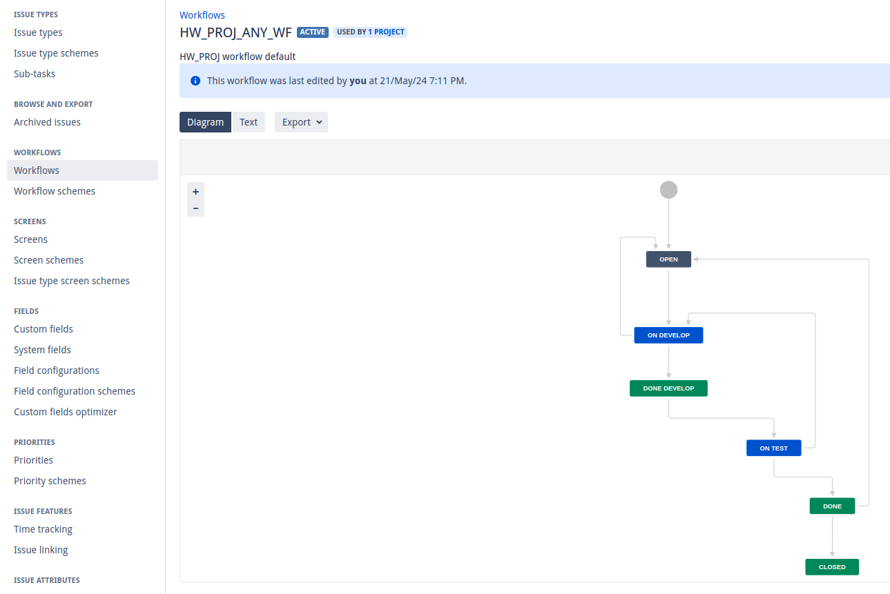

# Домашнее задание к занятию 7 «Жизненный цикл ПО»
---
В домашнем задании использован docker-образ Jira:


```[kes@localhost ~]$ docker pull atlassian/jira-software```
```[kes@localhost ~]$ docker volume create --name jiraVolume```
```[kes@localhost ~]$ docker run -v jiraVolume:/var/atlassian/application-data/jira --name="jira" -d -p 8080:8080 atlassian/jira-software```

---
Создан проект, kanban- и scrum-доски, применены описанные в задании статусы, настроены 2 workflow:
1. Для задач типа bug


[XML для worlflow](./HW_PROJ_BUG_WF.xml)

2. Для остальных типов задач:



[XML для worlflow](./HW_PROJ_ANY_WF.xml)

---
Созданные задачи разных типов успешно проводятся в доске kanban и по спринту в доске scrum по workflow, не описанные переходы не доступны.
